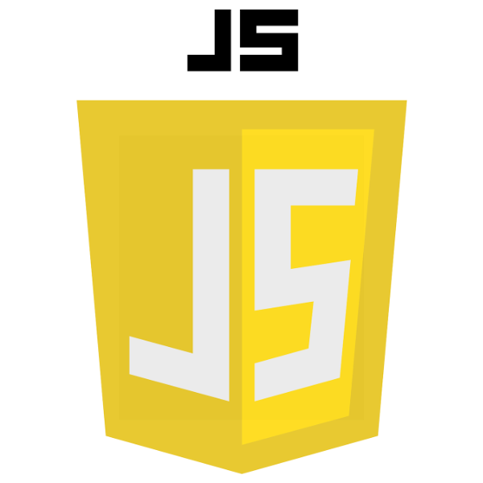
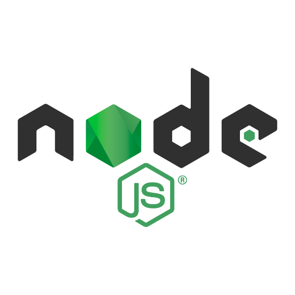
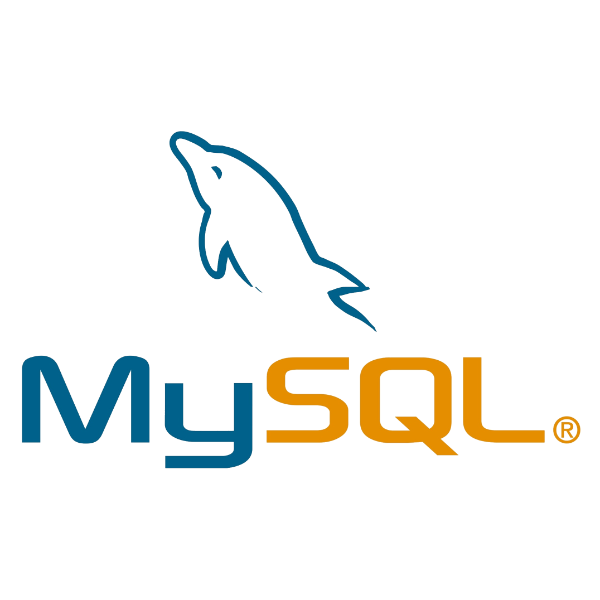
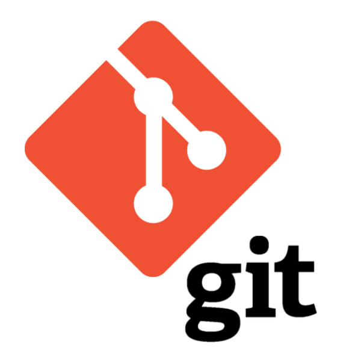

# Hi there! My name is Kelley.

I'm a self-taught front-end developer transitioning from a career in geoscience. 

I'm passionate about creating beautiful and minimal yet functional web products. 

If you'd like to learn more about my skills and experience please visit my [portfolio](kelleyfraser.com)

## :woman_technologist: About me

- :earth_africa: United States -> Canada -> England
- :mortar_board: Bachelor's and Master's degree in Geology. Currently finishing a coding bootcamp with HyperionDev
- :computer: I'm currently learning Node.js and mongoDB
- :link: You can contact me via [kelleyirwinfraser@gmail.com](kelleyirwinfraser@gmail.com)

## :computer: Tech stack

</img>
</img>
</img>
</img>
</img>
</img>
</img>
</img>
</img>
</img>
</img>
</img>

